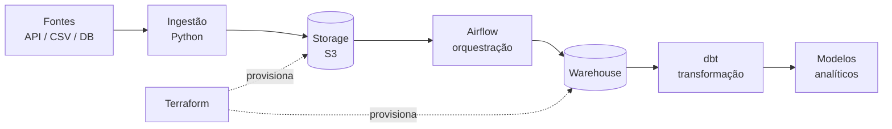

# data-platform

# data-platform

[](https://github.com/ricardolagarini/data-platform/actions/workflows/ci.yml)


Pipeline de dados end-to-end com infraestrutura gerida como código. O objetivo é ter um ambiente reprodutível: um `terraform apply` levanta a infra, um comando levanta o Airflow local, e o mesmo código corre em local e em cloud.

> **Estado:** projeto em construção. A base de CI está a funcionar; os componentes de ingestão, infra e transformação estão a ser adicionados de forma incremental. Ver [Roadmap](#roadmap).

## Arquitetura alvo



## Stack

| Camada | Ferramenta | Estado |
|---|---|---|
| CI | GitHub Actions | ✅ |
| Infraestrutura | Terraform | 🚧 |
| Orquestração | Airflow | 🚧 |
| Transformação | dbt | 🚧 |
| Runtime | Docker | 🚧 |

## Estrutura

```
.
├── .github/workflows/ci.yml   # lint, testes e validação de infra
├── requirements.txt
├── infra/                     # Terraform — storage, warehouse, IAM  (em construção)
├── src/                       # ingestão e utilitários               (em construção)
├── dags/                      # DAGs do Airflow                      (em construção)
├── dbt/                       # modelos de transformação             (em construção)
└── tests/                     # testes unitários                     (em construção)
```

## Como correr localmente

Pré-requisitos: Python 3.12. (Docker e Terraform passam a ser necessários assim que os respetivos componentes existirem.)

```bash
git clone https://github.com/ricardolagarini/data-platform.git
cd data-platform

python -m venv .venv && source .venv/bin/activate
pip install -r requirements.txt

# as mesmas verificações que correm no CI
ruff check .
ruff format --check .
```

## CI

O workflow corre em cada push para `main` e em cada pull request:

- `ruff check` e `ruff format --check` no código Python
- `pytest` na pasta `tests/`
- `terraform fmt`, `init` e `validate` na pasta `infra/`

Os passos de Terraform e de testes são saltados automaticamente enquanto as respetivas pastas não existirem, para o pipeline não falhar durante o desenvolvimento inicial.

## Roadmap

- [x] Pipeline de CI com lint e validação
- [ ] Módulo Terraform para storage e warehouse
- [ ] Backend remoto de state (S3 + DynamoDB lock)
- [ ] `terraform plan` automático em PRs com comentário no diff
- [ ] Primeira DAG de ingestão
- [ ] Ambiente local com Docker Compose
- [ ] Testes de qualidade de dados com dbt
- [ ] Alertas de falha de DAG

## Licença

MITos com dbt
 Alertas de falha de DAG
