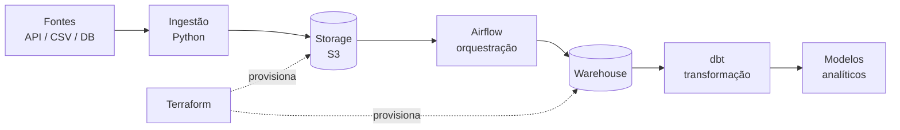

# data-platform


Pipeline de dados end-to-end com infraestrutura gerida como código. O objetivo é ter um ambiente reprodutível: um `terraform apply` levanta a infra, um comando levanta o Airflow local, e o mesmo código corre em local e em cloud.

## Arquitetura



## Stack

| Camada | Ferramenta |
|---|---|
| Infraestrutura | Terraform |
| Orquestração | Airflow |
| Transformação | dbt |
| Runtime | Docker |
| CI | GitHub Actions |

## Estrutura

```
.
├── infra/          # Terraform — storage, warehouse, IAM
├── dags/           # DAGs do Airflow
├── src/            # ingestão e utilitários
├── dbt/            # modelos de transformação
├── tests/          # testes unitários
└── .github/workflows/ci.yml
```

## Como correr localmente

Pré-requisitos: Docker, Terraform >= 1.9, Python 3.12.

```bash
git clone https://github.com/clearbuild-rl/data-platform.git
cd data-platform

# dependências
pip install -r requirements.txt

# infra (dry-run, sem backend remoto)
cd infra && terraform init -backend=false && terraform validate && cd ..

# ambiente local
docker compose up -d
```

O Airflow fica disponível em `http://localhost:8080`.

## CI

O workflow corre em cada push para `main` e em cada pull request:

- `ruff check` e `ruff format --check` no código Python
- `pytest` na pasta `tests/`
- `terraform fmt`, `init` e `validate` na pasta `infra/`

Os passos de Terraform e de testes são saltados automaticamente se as respetivas pastas ainda não existirem, para o pipeline não falhar durante o desenvolvimento inicial.

## Estado

Projeto em desenvolvimento ativo. Próximos passos:

- [ ] Backend remoto de state (S3 + DynamoDB lock)
- [ ] `terraform plan` automático em PRs com comentário no diff
- [ ] Testes de qualidade de dados com dbt
- [ ] Alertas de falha de DAG

